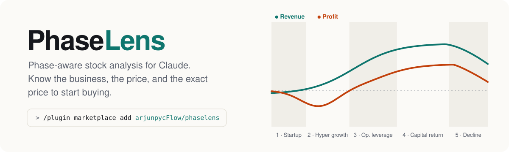
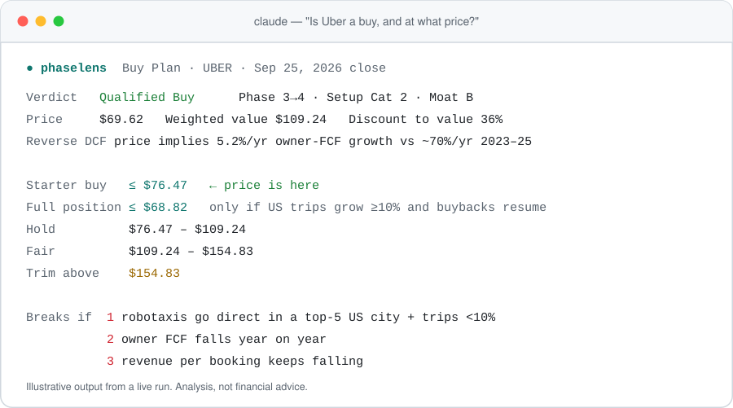
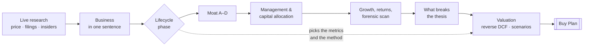

<div align="center">

<picture>
  <source media="(prefers-color-scheme: dark)" srcset="assets/banner-dark.svg">
  
</picture>

<br>

[](https://github.com/arjunpycFlow/phaselens/actions/workflows/ci.yml)
[](https://github.com/arjunpycFlow/phaselens/releases/latest)
[](LICENSE)
[](#install)
[](skills/phaselens/SKILL.md)
[](tests/test_valuation.py)
[](SECURITY.md)

**[Install](#install)** · **[How it works](#how-it-works)** · **[Example](examples/uber-2026-09.md)** · **[Evals](#tested-not-just-claimed)** · **[FAQ](#faq)**

</div>

---

Ask Claude *"Is Uber a buy, and at what price?"* and PhaseLens answers three questions in order: **is it a good business, is it a good price, and at exactly what price do you start buying, add, hold or trim?**

Most stock checklists apply one yardstick to every company. That is the most common mistake in stock analysis: a fast-growing software company judged on earnings always looks expensive, and a mature utility judged on growth always looks broken. PhaseLens first places the company in its **lifecycle phase** and lets the phase choose the metrics and the valuation method. It then judges the business before it looks at the price, so the price tests the thesis instead of shaping it.

<div align="center">
<picture>
  <source media="(prefers-color-scheme: dark)" srcset="assets/buy-plan-dark.svg">
  
</picture>
</div>

> [!IMPORTANT]
> PhaseLens is a research framework, not financial advice. It structures the analysis and shows every number; the decision is yours.

## Install

### Claude Code

Add the marketplace once, then install from the plugin browser:

```text
/plugin marketplace add arjunpycFlow/phaselens
/plugin
```

In **Discover**, select **phaselens** and choose a scope (**Install for you** is the usual choice). Or install directly:

```text
/plugin install phaselens@phaselens
```

**You should see** `Plugin is now active.` (or a prompt to run `/reload-plugins`). Type `/` and **`/phaselens:phaselens`** appears. Then just ask about a stock; the skill loads on its own.

<details>
<summary><b>Claude Code desktop app, VS Code, or your shell</b></summary>

<br>

| Where | How |
|---|---|
| **Desktop app** (Code tab) | Run `/plugin marketplace add arjunpycFlow/phaselens` once, then **+** → **Plugins** → **Add plugin** → **PhaseLens** → choose a scope. |
| **VS Code** | Type `/plugins` → **Marketplaces** tab → add `arjunpycFlow/phaselens` → **Plugins** tab → **PhaseLens** → **Install**. |
| **Shell** | `claude plugin marketplace add arjunpycFlow/phaselens` then `claude plugin install phaselens@phaselens` |
| **One command** (v2.1.275+) | `/plugin install phaselens --marketplace arjunpycFlow/phaselens` |

Check it with `claude plugin list`, which shows `phaselens@phaselens` with `Status: ✔ enabled`.

</details>

### Claude apps (claude.ai and desktop)

1. Download **[`phaselens.zip`](https://github.com/arjunpycFlow/phaselens/releases/latest/download/phaselens.zip)** from the latest release.
2. In Claude, open **[Customize → Skills](https://claude.ai/customize/skills)** → **+** → **Create skill** → **Upload a skill**, and choose the zip.
3. Make sure **Code execution and file creation** and **Skills** are on in **Settings → Capabilities**. Turn on web search too, so PhaseLens can pull live prices and filings.

On Team and Enterprise plans an owner may need to allow uploaded skills.

<details>
<summary><b>Agent SDK, or a skills folder</b></summary>

<br>

Copy the skill folder into a skills directory; Claude Code and the Agent SDK discover it there:

```bash
git clone https://github.com/arjunpycFlow/phaselens.git
cp -r phaselens/skills/phaselens ~/.claude/skills/            # every project
# or: cp -r phaselens/skills/phaselens <project>/.claude/skills/  # one project
```

In the [Agent SDK](https://code.claude.com/docs/en/agent-sdk/skills), include the `user` or `project` setting source and allow the skill:

```python
options = ClaudeAgentOptions(
    setting_sources=["user", "project"],
    skills=["phaselens"],
    allowed_tools=["Read", "Bash", "WebSearch", "WebFetch"],
)
```

Other agents that support the open Agent Skills format read the same `skills/phaselens/` folder.

</details>

### Update or remove

- **Update:** `/plugin` → **Installed** → **phaselens** → **Update now**, or `claude plugin update phaselens@phaselens`. To update automatically, open `/plugin` → **Marketplaces** → **phaselens** → **Enable auto-update**.
- **Remove:** `/plugin` → **Installed** → **phaselens** → **Uninstall**, or `claude plugin uninstall phaselens@phaselens`.

## How it works



Every analysis follows the same ten steps, in this order. Valuation always comes last.

1. **Research, never from memory.** Live price, 10-K and 10-Q, Form 4 insider trades, 13F holders, and 5–10 years of history.
2. **Business in one sentence.** What it sells, to whom, and how it gets paid.
3. **Lifecycle phase.** Placed with three numbers: revenue growth, operating-margin direction, and what the company does with its cash.
4. **Moat, graded A–D,** with evidence: pricing power, market share against the closest competitors, returns on capital.
5. **Management and capital allocation.** Open-market insider buying counts; pre-planned selling is discounted.
6. **Growth and returns together,** plus a forensic scan for accounting red flags.
7. **What breaks the thesis:** three checkable triggers, six yellow flags, a pre-mortem and the strongest bear case.
8. **Valuation:** owner FCF (after stock-based pay), a reverse DCF, a cross-check, and bear / base / bull values.
9. **Portfolio fit:** overlapping risks and position size.
10. **Buy Plan:** the verdict and the price bands.

### The five phases

| Phase | Looks like | What to measure | How to value it |
|---|---|---|---|
| **1 · Startup** | small revenue, deepening losses | traction, gross margin, cash runway | market size, price/sales |
| **2 · Hyper growth** | fast growth, losses peaking | growth vs peers, retention, gross margin | price/sales, price/gross profit |
| **3 · Operating leverage** | profits appear, margins expand | margin expansion, FCF growth | forward P/E, forward P/FCF |
| **4 · Capital return** | steady growth, buybacks, dividends | FCF, ROIC, payout coverage | P/E, P/FCF, DCF, reverse DCF |
| **5 · Decline** | revenue and profit fading | balance-sheet runway | asset value, wide margin of safety |

Banks, insurers, REITs, utilities, cyclicals and foreign listings get their own inputs. See [special cases](skills/phaselens/references/special-cases.md).

### The Buy Plan

| Zone | Price | What it means |
|---|---|---|
| **Full position** | ≤ starter × 0.90 | add to full size, only if the thesis still holds |
| **Starter buy** | ≤ weighted value × (1 − margin of safety) | first tranche |
| **Hold** | starter → weighted value | own it; no new money |
| **Fair** | weighted value → bull value | own it; no new money |
| **Trim / pass** | above bull value | no plausible future justifies the price |

The **margin of safety scales with predictability, not excitement:** 0–10% for a proven compounder with an A moat, 20–25% for a stable business, 35–40% or more for cyclicals and turnarounds. For young growth companies no discount is enough, so PhaseLens sizes smaller instead.

## Tested, not just claimed

**The math.** 61 unit tests check `valuation.py` against closed-form results: the Gordon-growth special case, a zero-growth perpetuity, reverse-DCF round trips, band ordering, and clean refusals of bad inputs such as negative cash flow. They run in CI on every push.

**The behavior.** Five cases in [`evals/`](evals) run through [`claude plugin eval`](https://code.claude.com/docs/en/plugin-evals). Each case runs three times **with** PhaseLens and three times **without** it, so the difference shows what the skill adds:

| Case | With | Without | What it checks |
|---|:-:|:-:|---|
| Buy price from supplied numbers | **0.89** | 0.00 | phase, reverse DCF, correct starter and full-position prices, triggers |
| Hyper-growth company, negative FCF | **1.00** | 0.83 | values on price/sales and doesn't force a DCF |
| Regional bank | 1.00 | 1.00 | uses price/tangible book, not FCF |
| Price far above the bull case | 1.00 | 1.00 | says trim, not buy |
| Off-topic personal-finance question | 1.00 | 1.00 | the skill stays out of the way |

The skill triggered on **12 of 12** stock questions and on **0 of 3** off-topic runs. Where both columns score 1.00, Claude already gets it right on its own and PhaseLens keeps it that way. Results are from September 27, 2026; rerun them with `make eval`.

## Using it

Ask naturally. Any of these trigger the skill:

- *"Is Costco a buy right now?"*
- *"What price should I start buying Mastercard at?"*
- *"I own Nike. Hold, add or trim?"*
- *"Quick take: BKNG"* returns only the phase, moat, reverse DCF and Buy Plan.

Tell Claude your holdings, position caps and any rules you follow (for example "no more than 6% in any one theme"), and the portfolio-fit step applies them.

### The valuation helper on its own

`valuation.py` needs only Python 3.8+ and prints JSON.

```bash
python3 skills/phaselens/scripts/valuation.py \
  --price 69.62 --shares 2043 --fcf 8200 --growth 0.05 0.11 0.16 --mos 0.30
```

| Flag | Meaning | Default |
|---|---|---|
| `--price` | share price | required |
| `--shares` | diluted shares, millions | required |
| `--fcf` | owner FCF = operating cash flow − capex − stock-based pay, millions | required |
| `--growth` | bear / base / bull yearly owner-FCF growth, years 1–10 | required |
| `--mos` | required margin of safety, e.g. `0.25` | required |
| `--rate` | required return | `0.10` |
| `--terminal` | growth after year ten | `0.03` |
| `--years` | length of the first stage | `10` |

It works on an **equity basis**: owner FCF has already paid interest, so it is compared with market cap and debt is never subtracted twice. At a 10% return and 3% terminal growth, the end value is about 14.7× year-ten cash flow. That is deliberately conservative; for A-moat compounders a 9% hurdle is a defensible adjustment, used instead of a smaller margin of safety, not as well as one.

## What's inside

```text
phaselens/
├── .claude-plugin/
│   ├── plugin.json            # plugin manifest
│   └── marketplace.json       # this repo is its own marketplace
├── skills/phaselens/
│   ├── SKILL.md               # the workflow (153 lines)
│   ├── scripts/valuation.py   # reverse DCF, scenarios, price bands
│   └── references/            # read only when needed
│       ├── lifecycle-phases.md
│       ├── margin-of-safety.md
│       ├── red-flags-and-selling.md
│       └── special-cases.md
├── evals/                     # behavior evals for claude plugin eval
├── tests/                     # unit tests + SKILL.md rules check
├── examples/uber-2026-09.md   # a full worked example
└── .github/workflows/         # CI, and releases that build phaselens.zip
```

Only the skill's name and one-line description sit in Claude's context until a stock question comes up — about **180 tokens per session**, per `claude plugin details`. The workflow loads then, and the reference files load only when a step needs them.

## FAQ

<details>
<summary><b>Where does the data come from?</b></summary>
<br>
From Claude's own web search and fetch tools, during the analysis. PhaseLens tells Claude to use primary sources such as SEC filings and company releases, to mark anything it couldn't verify, and never to quote prices from memory. The plugin itself makes no network calls.
</details>

<details>
<summary><b>Does it work without web search?</b></summary>
<br>
Yes, if you supply the numbers: price, diluted shares, operating cash flow, capex and stock-based pay are enough for the valuation. The eval cases work this way. Without live data, Claude will say which steps it couldn't check.
</details>

<details>
<summary><b>Why "owner FCF" instead of free cash flow?</b></summary>
<br>
Stock-based pay is a real cost to shareholders even though no cash leaves the company. Subtracting it, using today's diluted share count, stops heavy-dilution companies from looking cheaper than they are.
</details>

<details>
<summary><b>Why does it refuse to value some companies with a DCF?</b></summary>
<br>
A DCF needs positive, forecastable cash flow. Startups, hyper-growth companies and declining businesses don't have it, so PhaseLens switches to price/sales, price/gross profit or asset value, and says the answer is a range.
</details>

<details>
<summary><b>Can it trade for me or predict prices?</b></summary>
<br>
No. It never predicts a future price or date, and it doesn't place orders. It gives scenario values with their assumptions and the price levels at which the numbers support buying or trimming.
</details>

<details>
<summary><b>The skill didn't trigger.</b></summary>
<br>
Ask about a specific company and whether to buy it or at what price, or call it directly with <code>/phaselens:phaselens</code> in Claude Code. In the Claude apps, check that the skill is switched on under Customize → Skills.
</details>

## Contributing

Issues and pull requests are welcome. Please cite a source for any new rule, and run the evals for behavior changes. See [CONTRIBUTING.md](CONTRIBUTING.md).

## Credits

The lifecycle-phase framework and several checklists (the five phases, the phase-to-valuation matrix, the six yellow flags, the four reasons to sell, and dividend-safety scoring) are adapted from Brian Feroldi's published guides at [Stock Simplifier](https://stocksimplifier.com/learn). Margin of safety follows Benjamin Graham. PhaseLens is independent and not affiliated with or endorsed by Stock Simplifier.

## License

[MIT](LICENSE). PhaseLens is provided for research and education. It is not investment advice, and nothing it produces is a recommendation to buy or sell any security.
